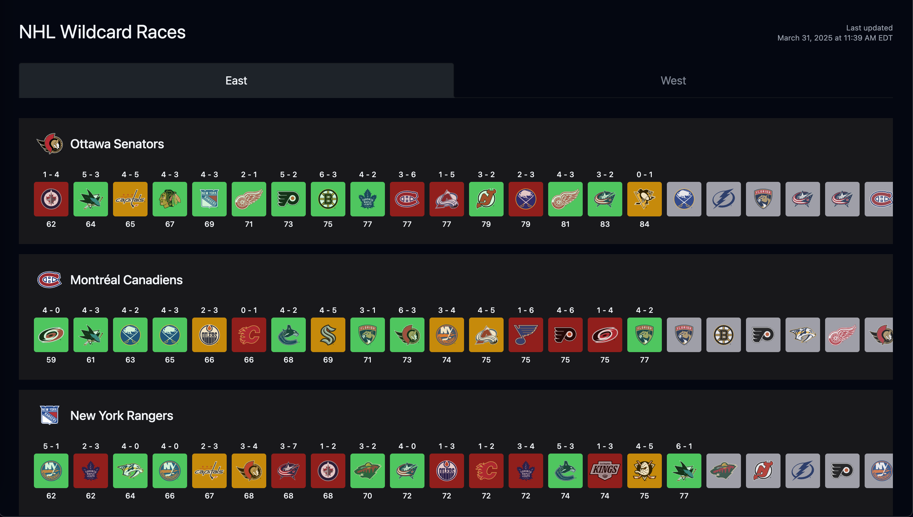

# NHL Wildcard Races



https://nhlwildcard.com

A way to visualize the NHL wild card race and playoff positioning.

Inspired by [u/Sarke1](https://www.reddit.com/r/hockey/comments/1jn7rlh/wildcard_races_mar_29/).

You can submit improvements/requests on [Reddit](https://www.reddit.com/r/hockey/comments/1jnmhlt/wildcard_races_as_a_website/).

## Real Time Updates

A [GitHub action](https://github.com/johnzanussi/nhl-wildcard-races/blob/main/.github/workflows/game-tracker.yml) runs every 5 minutes to check if a game has completed. If it has, the site redeploys to include the updated results.


## Tech Stack

- **Framework**: [Astro](https://astro.build)
- **CSS**: [Tailwind CSS](https://tailwindcss.com)
- **Deployment**: [Vercel](https://vercel.com)
- **Data Source**: NHL Stats API

## Local Development

### Prerequisites

- Node.js (v16 or higher)
- npm

### Installation

1. Clone this repository
   ```bash
   git clone https://github.com/johnzanussi/nhl-wildcard-races.git
   cd nhl-wildcard-races
   ```

2. Install dependencies
   ```bash
   npm install
   ```

3. Start the development server
   ```bash
   npm run dev
   ```

4. Open your browser and navigate to `http://localhost:4321`

## Building for Production

```bash
npm run build
```

The built application will be in the `dist/` directory.

## Contributing

Contributions are welcome! Feel free to submit a pull request or open an issue if you have ideas for improvements or have found a bug.

1. Fork the repository
2. Create your feature branch (`git checkout -b feature/feature`)
3. Commit your changes (`git commit -m 'Add some feature'`)
4. Push to the branch (`git push origin feature/feature`)
5. Open a Pull Request

## License

This project is licensed under the GNU General Public License v3.0 - see the [LICENSE](LICENSE) file for details.

### What this means:

- You are free to use, modify, and distribute this software.
- If you distribute modified versions, you must make your source code available under the same license.
- Any work based on this code must also use the GPL license.
- There is no warranty for this program, to the extent permitted by applicable law.

For more information about the GPL-3.0 license, visit [GNU.org](https://www.gnu.org/licenses/gpl-3.0.en.html).
